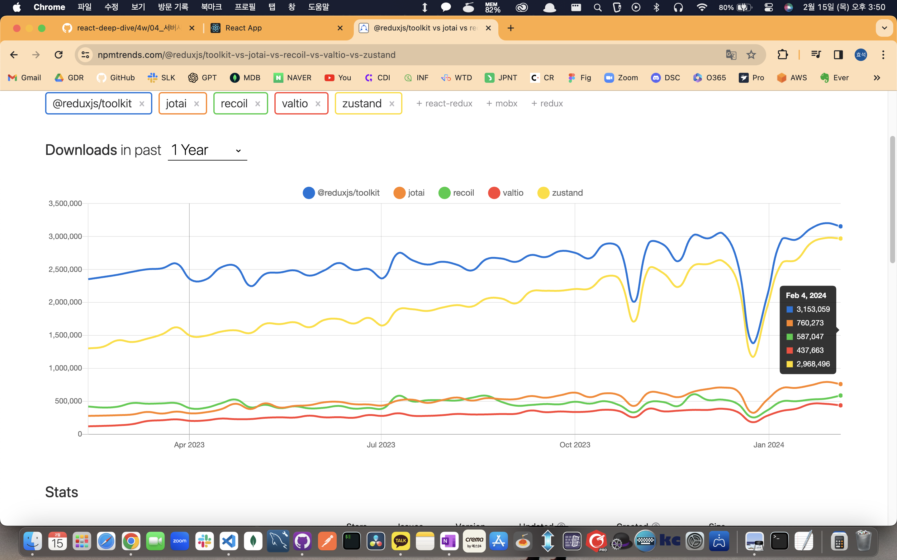

# 05. 리액트와 상태 관리 라이브러리

## 5.1 상태 관리는 왜 필요한가?

- 상태는 어떠한 의미를 지닌 값이면 어플리케이션의 시나리오에 따라 지속적으로 변경될 수 있는 값을 의미한다
- UI : 상호 작용이 가능한 모든 요소의 현재 값
- URL : 브라우저에 의해 관리되고 있는 상태 값
- Form: 폼의 상태, 로딩 / 제출 / 접근 가능여부 / 값의 유효성
- 서버에서 가져온 값

### 5.1.1 리액트 상태 관리의 역사

#### Flux 패턴의 등장

- 리액트로 작성 된 어플리케이션의 크기가 방대해짐에 따라 상태를 관리 추적하는 것에 어려움이 발생
- 페이스북 팀은 상태 관리 어려움의 원인을 양방향 데이터 바인딩이라고 보고, 단방향으로 데이터 흐름을 변경하는 것을 제안하는데 이것이 바로 Flux 패턴이다
- Action -> Dispatcher -> Store -> View 의 방향
- 이러한 단방향 흐름은 상태의 관리 및 추적에는 유리했지만, 사용자의 입력에 따라 데이터를 갱신하고 화면을 업데이트 하는 코드도 추가가 되는 불편함이 존재

#### 시장 지배자 리덕스의 등장

- 리덕스는 Flux 구조에 Elm 아키텍쳐를 도입하여 시장을 지배
- Elm 은 데이터를 Model, View, Update 라는 단방향 흐름으로 강제하여 어플리케이션의 상태를 안정적으로 관리
- 다만 해당 기능을 사용하기 위해 많은 보일러 플레이트 코드가 필요하다는 단점이 존재

#### Context API 와 useContext

- Props Drilling 등의 문제 해결을 위해 16.3 버전에서 Context API 를 출시

#### 훅의 탄생, 그리고 React Query 와 SWR

- 16.8 버전에서 함수 컴포넌트에 사용 가능한 훅 API 를 추가
- 훅으로 인하여 state 관리가 단순화 되어 React Query 와 SWR 라는 통신 요청에 특화된 상태 관리 라이브러리가 탄생
- 리덕스에 비해 보일러 플레이트 코드를 줄일 수 있는 장점이 존재

#### Recoil, Zustand, Jotai, Valtio 에 이르기까지

- 리덕스에 이어 훅을 이용하여 작은 크기의 상태를 효율적으로 관리하는 상태관리 라이브러리가 탄생

### 5.1.2 정리

## 5.2 리액트 훅으로 시작하는 상태 관리

### 5.2.1 가장 기본적인 방법: useState 와 useReducer

- useState 와 useReducer 를 사용하면 간단한 상태 관리가 가능
- 하지만 훅을 사용할 때 마다 컴포넌트 별로 초기화 되므로 컴포넌트 별로 다른 상태를 가지게 되어, 해당 컴포넌트에서만 상태가 유효하다는 한계점이 존재
- 아래와 같이 상태를 한단계 끌어올리는 방법이 존재하지만, 상태를 자식에게 props 로 전달해야하는 불편함이 발생

```jsx
function Counter1({ counter, inc }: { counter: number, inc: () => void }) {
  return (
    <>
      <h3>Counter1: {counter}</h3>
      <button onClick={inc}>+</button>
    </>
  );
}

function Counter2({ counter, inc }: { counter: number, inc: () => void }) {
  return (
    <>
      <h3>Counter2: {counter}</h3>
      <button onClick={inc}>+</button>
    </>
  );
}

function Parent() {
  const { counter, inc } = useCounter();
  return (
    <>
      <Counter1 counter={counter} inc={inc} />
      <Counter2 counter={counter} inc={inc} />
    </>
  );
}
```

### 5.2.2 지역 상태의 한계를 벗어나보자: useState의 상태를 바깥으로 분리하기

- 상태를 클로저에 맡기는 것이 아니라, JS 실행 문맥 내에서 초기화가 가능하도록 분리해보기

```tsx
// counter.ts
export type State = { counter: number };

// 상태를 아예 컴포넌트 밖에 선언했다. 각 컴포넌트가 이 상태를 바라보게 할 것이다.
let state: State = { counter: 0 };

// getter
export function get(): State {
  return state;
}

// useState와 동일하게 구현하기 위해 게으른 초기화 함수나 값을 받을 수 있게 했다.
type Initializer<T> = T extends any ? T | ((prev: T) => T) : never;

// setter
export function set<T>(nextState: Initializer<T>) {
  state = typeof nextState === "function" ? nextState(state) : nextState;
}

// Counter
function Counter() {
  const state = get();

  function handleClick() {
    set((prev: State) => ({ counter: prev.counter + 1 }));
  }

  return (
    <>
      <h3>{state.counter}</h3>
      <button onClick={handleClick}>+</button>
    </>
  );
}
```

- 하지만 해당 코드는 상태값의 변경은 정상적으로 작동되나 컴포넌트가 리렌더링되지 않아 문제가 발생한다
- 해당 문제를 해결하기 위해, 외부 state 값을 컴포넌트 내부의 useState 의 인수로 전달하는 방식으로 해결

```tsx
function Counter1() {
  const [count, setScount] = useState(state);

  function handleClick() {
    // 외부에서 선언한 set 함수 내부에서 다음 상태값을 연산한 다음, 그 값을 로컬 상태값에도 넣기
    set((prev: State) => {
      const newState = { counter: prev.counter + 1 };
      // setCount 의 호출로 리렌더링 발생
      setCount(newState);
      // return 으로 업데이트 된 상태값을 외부 상태에 반영
      return newState;
    });
  }

  return (
    <>
      {/* 컴포넌트 내부의 state 인 count 사용 */}
      <h3>{count.counter}</h3>
      <button onClick={handleClick}>+</button>
    </>
  );
}
```

- 위와 같은 코드는 작동은 하지만 외부에서 관리하는 state 를 다시 컴포넌트 내부에서 state 로 선언하여 사용하는 등의 문제가 발생한다
- 또한, 액션이 발생한 컴포넌트는 리렌더링이 발생하지만 다른 컴포넌트에서 외부 상태값을 참조하고 있을 경우 해당 컴포넌트는 다시 렌더링이 발생하기 전까지는 변경된 상태값 적용이 안된다
- 이를 해결하기 위해서는 별도의 기능을 하는 createStore, useStore 등의 코드를 만들어서 사용해야만 한다
- 이와 비슷한 기능은 React 의 useSubscription 을 통해 구현되어 있다

\*\* [p. 367] 이거 코드 길게 잘 써놨는데.... 흐음 애매하네요 ㅎㅎㅎ
\*\* 막상 리덕스는 알알려주는....

### 5.2.3 useState 와 Context를 동시에 사용해 보기

- 스토어를 사용하는 경우 스토어가 여러개가 되면 컴포넌트에서 어떤 스토어를 사용해야하는지 판단하기 어려운 단점이 존재
- Context 를 이용하여 스토어를 컴포넌트에 주입하면, 위의 문제를 해결할 수 있다
- 대부분의 상태관리 라이브러리는 위와 같은 방식으로 구성되어 있으며, 아래의 장점을 가진다
  - useState, sueReducer 와 같이 지역적 사용이 아닌 글로벌 활용이 가능하다
  - 상태가 변경되면 참조하고 있는 모든 컴포넌트의 렌더링이 발생한다

### 5.2.4 상태관리 라이브러리 Recoil, Jotai, Zustand 알아보기

- Recoil, Jotai 는 Context 와 Provider 그리고 훗을 기반으로 작은 상태를 효율적으로 관리하기 좋음
- Zustand 는 하나의 큰 스토어를 기반으로 상태를 관리하기 좋음. Context 가 아닌 클로저를 기반으로 스토어가 생성됨

#### 페이스북이 만든 상태 관리 라이브러리 Recoil

- 리액트를 위한 Atomic 상태 관리 라이브러리, 하지만 아직 베타
- 리액트의 v18 에 맞추어 동시성 렌더링, 서버 컴포넌트, Streaming SSR 지원 이후에 1.0.0 을 배포 예정
- RecoilRoot 를 최상단에 선언에 하나의 스토어를 만들고 Atom 이라는 상태 단위를 스토어에 등록
- Recoil 의 훅을 통해 상태 변화를 구독하고 값이 변하면 리렌더링을 통해 Atom 의 값을 참조

- 예시 코드

```jsx
import {
  RecoilRoot,
  atom,
  selector,
  useRecoilState,
  useRecoilValue,
} from "recoil";

// Recoil 파트
const counterState = atom({
  key: "counterState",
  default: 0,
});

function Counter() {
  const [, setCount] = useRecoilState(counterState);

  function handleBtnClick() {
    setCount((count) => count + 1);
  }

  return (
    <>
      <button onClick={handleBtnClick}>+</button>
    </>
  );
}

const isBiggerThen10 = selector({
  key: "above10State",
  get: ({ get }) => {
    console.log(get(counterState));
    return get(counterState) >= 10;
  },
});

function Count() {
  const count = useRecoilValue(counterState);
  const biggerThen10 = useRecoilValue(isBiggerThen10);

  return (
    <>
      <h3>{count}</h3>
      <p>10 보다 큰가? : {JSON.stringify(biggerThen10)}</p>
    </>
  );
}

function App() {
  return (
    <div className="App">
      <RecoilRoot>
        <Counter />
        <Count />
      </RecoilRoot>
    </div>
  );
}

export default App;
```

##### 특징

- 메타에서 만드는 만큼 리액트의 신기능들을 가장 잘 지원할 것으로 예상
- 리덕스와 달리 redux-saga 나 redux-thunk 를 사용하지 않아도 비동기 작업을 지원
- 아직 정식 버전이 아니므로 사용에 있어서 주의 필요

#### Recoil 에서 영감을 받은, 그러나 조금 더 유연한 Jotail

- Recoil 과 마찬가지로 Atomic 스타일의 상태 관리 라이브러리이며 작은 단위의 상태를 위로 전파할 수 있는 구조
- atom 을 통해 상태를 선언하면 해당 상태는 컴포넌트 외부에서도 사용이 가능하다. 따라서 RecoilRoot 로 하위 컴포넌트를 감쌀 필요가 없다
- Recoil 대비 간결한 코드, 객체 참조를 통해 문자열 key 값 없이 상태값 관리 가능
- 그외의 API 및 localStorage 연동, Next, React Native 등 다양한 기능을 지원
- 정식 버전이므로 상용 어플리케이션에 적용 가능

- 예시 코드

```jsx
import { atom, useAtom, useAtomValue } from "jotai";

const counterState = atom(0);

function Counter() {
  const [, setCount] = useAtom(counterState);

  const handleBtnClick = () => setCount((count) => count + 1);

  return (
    <>
      <button onClick={handleBtnClick}>+</button>
    </>
  );
}

const isBiggerThen10 = atom((get) => get(counterState) >= 10);

function Count() {
  const count = useAtomValue(counterState);
  const biggerThen10 = useAtomValue(isBiggerThen10);

  return (
    <>
      <h3>{count}</h3>
      <p>10 보다 큰가? : {JSON.stringify(biggerThen10)}</p>
    </>
  );
}

export default function JotailComponent() {
  return (
    <div>
      <h2>조타이</h2>
      <Counter />
      <Count />
    </div>
  );
}
```

\*\* 리코일은 10보다 biggerThan 이 >= 10 이고 Jotai 는 왜 > 10 이죠? ㅋㅋㅋㅋㅋ
\*\* [p. 383] 리코일 코드에서 key 는 또 above10State 고.... 오락가락 하시네여

#### 작고 빠르면 확장에도 유연한 Zustand

- Redux 에서 영감을 받아 만든 Flux 타입 상태 관리 라이브러리, 따라서 하나의 큰 스토어를 기반으로 상태를 관리한다
- 코드가 제일 간결하고 사용이 쉽다
- 라이브러리의 코드의 용량 자체도 작아서 작고 빠르다
- API 가 간단한 구조를 가진다면 Zustand 는 좋은 선택지이다

- 예시 코드

```jsx
import { create } from "zustand";

const useCounterStore = create((set) => ({
  count: 1,
  inc: () => set((state) => ({ count: state.count + 1 })),
  dec: () => set((state) => ({ count: state.count - 1 })),
}));

export default function ZustandComponent() {
  const { count, inc, dec } = useCounterStore();

  const biggerThan10 = String(count >= 10);

  return (
    <div>
      <h2>Zustand</h2>
      <button onClick={inc}>+</button>
      <button onClick={dec}>-</button>
      <h3>{count}</h3>
      <p>10 보다 큰가? : {biggerThan10}</p>
    </div>
  );
}
```

\*\* 전 redux 로 배워서 그런지 zustand 가 압도적으로 편해 보입니다! 다들 어찌 생각하시나요?

### 5.2.5 정리



- 상황에 맞는, 그리고 프레임워크의 변화에 따르게 대응하는 라이브러리를 선택하는 것이 유리하다!

\*\* 근데 리덕스나 발티오 같은건 안가르쳐 주나요?? 그래도 쉐어 1위인데?
