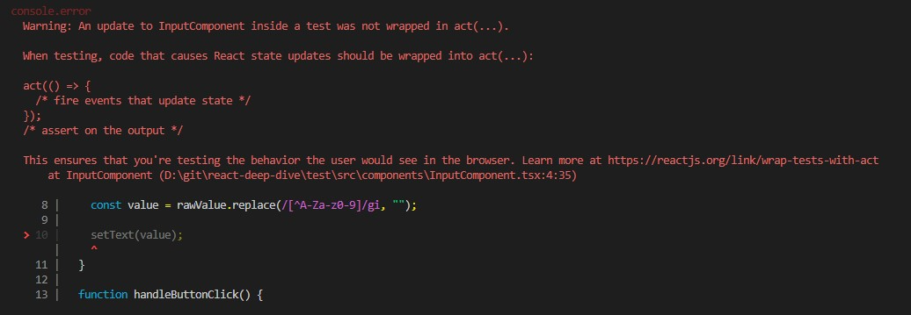
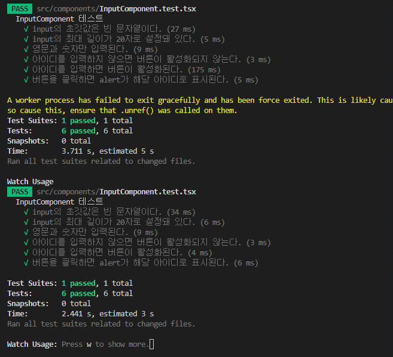

\*\* 이야기해볼 거리

- 단, React 18 버전으로 넘어오면서 약간의 warning 이 생기는 문제 발생 중

- 책에 나온 코드

```js
it("영문과 숫자만 입력된다.", () => {
  const { input } = setup();
  const inputValue = "안녕하세요123";

  // 사용자의 입력을 흉내내는 메서드, 사용자가 키보드로 타이핑을 하는 것을 테스트 가능
  userEvent.type(input, inputValue);

  expect(input.value).toEqual("123");
});
```

- userEvent 사용시 발생하는 Warning 상황
  

- React 18 이상 버전에서 실제 문제 없이 작동하는 코드

```js
it("영문과 숫자만 입력된다.", () => {
  const { input } = setup();
  const inputValue = "안녕하세요123";

  // fireEvent 로 처리해야 문제가 생기지 않음
  fireEvent.change(input, { target: { value: inputValue } });

  expect(input.value).toEqual("123");
});
```

- fireEvent 로 변경 후, 정상 작동하는 상황
  

- 아마도, Testing Library 의 경우 테스트 이외의 상황에서 컴포넌트의 변화가 발생하면 테스트 결과가 맞아도 위와 같은 Warining 을 발생하는 것을 확인 가능
- userEvent 의 경우 fireEvent 의 input 이 여러번 발생하는 구조이므로, setText 가 계속 적으로 컴포넌트를 업데이트 하는 상황이 발생하여 생기는 에러로 추측
- 따라서 userEvent.type 이 아닌 fireEvent.change 로 한번에 값의 변화를 주고 테스트 하면 정상 테스트가 되는 것을 확인 가능

  - 아이디어 참고 : https://kentcdodds.com/blog/fix-the-not-wrapped-in-act-warning
  - 한번 쯤 보면 매우 좋을듯, 컴포넌트의 모든 상태 변화에 대한 이해를 바탕으로 테스트를 작성해야 한다는 점
  - 실제 사례를 보면, 비동기로 상태를 반영하기 때문에 promise 를 테스트 상황에서 예외 처리하는 것을 볼 수 있다

  - 실제 해결 사례 내용 : https://github.com/testing-library/react-testing-library/issues/1051
  - React 18 버전으로 업데이트 되면서 생긴 문제라는 것으로 보아 리액트의 변화 사항을 testing-library 가 반영하지 못한 상태로 추측

- 문제 해결을 위해 참고한 블로그들

  - https://flyingsquirrel.medium.com/testing-library-react%EC%9D%98-act%EB%8A%94-%EC%96%B8%EC%A0%9C-%EC%8D%A8%EC%95%BC%ED%95%A0%EA%B9%8C-c6036a8cd4b3

  - https://kentcdodds.com/blog/common-mistakes-with-react-testing-library
  - https://seongry.github.io/2021/06-20-common-mistakes-with-rty/
  - https://kentcdodds.com/blog/fix-the-not-wrapped-in-act-warning
  - https://github.com/kentcdodds/fix-act-warning-demos/blob/main/src/__tests__/username-form.js
