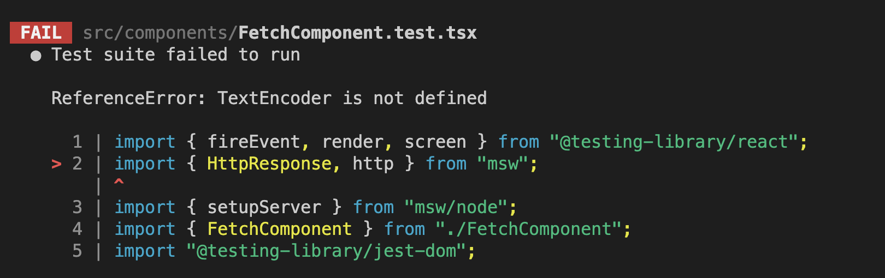
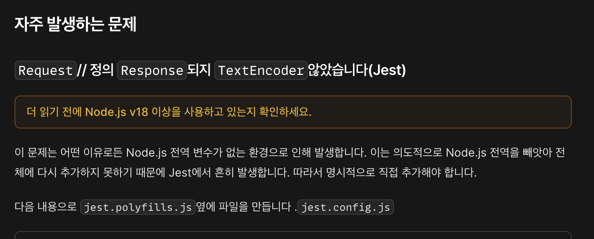
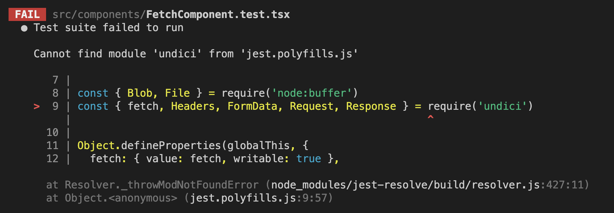
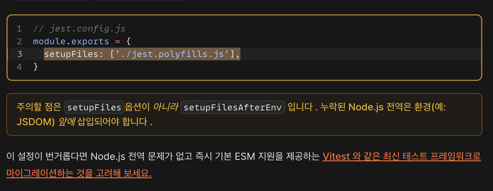

- 비동기 컴포넌트에서 msw 이슈를 해결하기 위해 이리저리 삽질한 Story

- CRA + MSW 2.0 버전에서의 이슈로 인하여, 2.0 문법을 사용하면 특정 모듈이 import 가 안되는 이슈가 발생
- 해결을 위해 다양한 접근을 했지만, 모두다 제대로 동작하지 않는 이슈 발생
- CRA 를 사용하지 않기 위해, Vite 를 사용하여 번들링
- Vite 에, jest, msw 등등을 설치하고 테스트
- Vite 에서 jest 사용을 위한 설정 참고
  - https://xionwcfm.tistory.com/369
- 그래서 실행을 했으나, 아래와 같은 이슈 발생

- 이를 해결하기 위해 msw 공식 문서를 확인

- node v20 사용중 & jest.polifills.js 적용, 그러나

- 그래서 찾아보니 CRA 이슈로 node 환경에서 global 이 제대로 안불러와지는 문제라고 한다. 그래서 더 찾아보니

# 결론, vitest 로 갈아탈 타이밍이다;;;;;

- 테스트 해보자!
